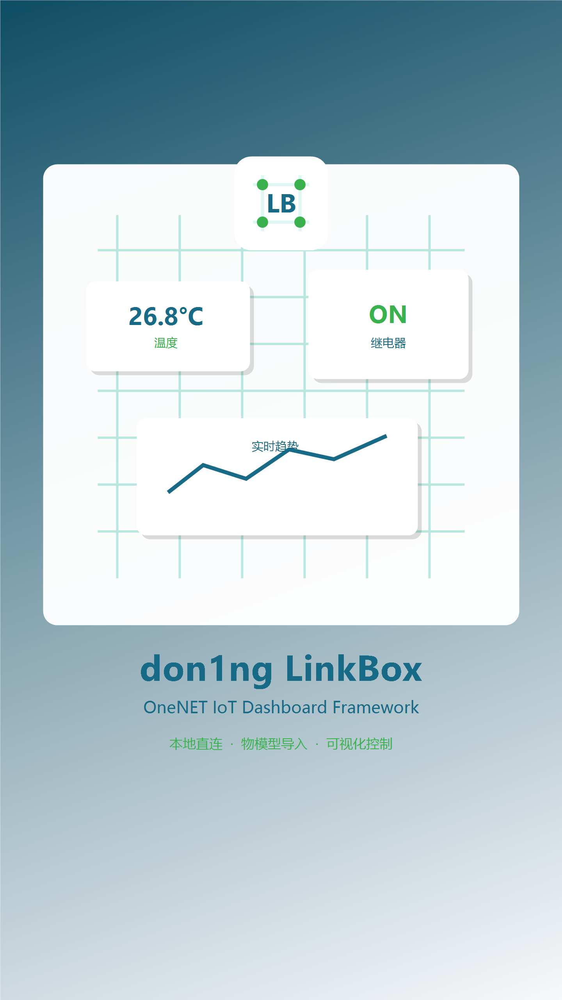

# don1ng LinkBox

don1ng LinkBox 是一个 Flutter Android 应用，用于把 OneNET Studio 物模型设备快速接入手机端监控和控制面板。当前版本默认使用设备 Token 快速接入，导入 `Token.log` 和 OneNET TSL JSON 后即可通过 MQTT 连接和控制；需要云端历史查询时仍可启用高级应用接入。



## 当前版本

- 最新版本：`v0.5.0`
- 应用版本：`0.5.0+6`
- Release 页面：[don1ng LinkBox v0.5.0](https://github.com/2152165718hd-crypto/don1ng-LinkBox/releases/tag/v0.5.0)
- 状态：Android MVP；Release 支持本地签名 APK 构建，签名密钥不提交到仓库。
- 更新日志：[CHANGELOG.md](CHANGELOG.md)
- 版本管理规范：[VERSIONING.md](VERSIONING.md)

## 版本管理

每个正式版本都必须同步维护 Git tag、`pubspec.yaml`、`CHANGELOG.md` 和 GitHub Release 说明。新版 Release notes 需要说明相较上一版的新增、变更、修复、迁移影响、验证结果和发布产物状态。

## 功能特性

- 默认设备 Token 快速接入：导入 `Token.log` 和 OneNET TSL JSON 即可连接。
- 高级 OneNET 项目分组/用户鉴权配置，本地保存，`AccessKey` 使用安全存储单独保存。
- OpenAPI：高级应用接入下支持最新属性查询、历史属性查询、属性设置。
- MQTT TLS 长连接：简单模式使用设备 Token 身份，高级模式保留应用长连接。
- OneNET TSL JSON 导入：提取 `identifier`、`name`、`dataType`、`specs`、`accessMode`，异常属性会跳过并生成导入报告。
- 物模型删除：可清理已导入物模型、面板配置和本地历史数据，并自动断开当前实时连接。
- Token.log 识别：可自动带出 `Product ID`、`Device Name`、Token 有效期，并使用 `DeviceKey` 自动续期设备 Token。
- 自动生成默认面板：数值卡、进度条、仪表盘、开关、按钮、滑块、枚举选择、状态文本、趋势图。
- 可编辑 UI 卡片：支持显示模式、尺寸、颜色、单位显示、小数位和图标配置。
- 内置 IoT PNG 图标库：温度、湿度、光照、烟雾、距离、开关、继电器、电机、设备。
- 支持上传 PNG 作为单个控件图标。
- 运行页：实时数据刷新、控制下发前校验、离线拦截、历史曲线。
- 本地日志和配置导入/导出，导出默认不包含密钥。
- 运行数据按历史天数保留，日志自动裁剪，减少长期运行后的本地存储膨胀。
- 品牌启动图、应用封面和 Android launcher icon。

## 运行环境

- Flutter 3.x
- Dart 3.x
- Android SDK
- JDK 17
- Android 设备或模拟器

本项目已提交 `pubspec.lock` 和 Android Gradle Wrapper，首次拉取后可以直接使用仓库内的 Gradle 配置。

## 本地运行

```bash
flutter pub get
flutter test
flutter run -d android
```

如果 Android 工程提示缺少 `android/local.properties`，执行一次 `flutter pub get`，或手动写入本机 Flutter SDK 路径：

```properties
flutter.sdk=C:\\path\\to\\flutter
```

## 构建 APK

调试或本地验证可以执行：

```bash
flutter build apk --release
```

构建产物会出现在：

```text
build/app/outputs/flutter-apk/app-release.apk
```

Release 构建会读取本机 `android/key.properties` 中的签名配置。该文件和 keystore 已加入 `.gitignore`，不要提交到仓库。面向用户分发 APK 前，请确认产物可以通过 `apksigner verify`。

## OneNET 配置

默认使用设备 Token 快速接入，只需要在设备页一次选择两份文件：

- `Token.log`
- OneNET TSL JSON 物模型文件

App 会从 `Token.log` 解析 `Product ID`、`Device Name`、`DeviceKey`/`Token`，从物模型 JSON 解析属性和 `profile.productId`，两份文件的产品 ID 不一致时会拒绝导入。

高级应用接入仍然保留在配置页折叠区，需要填写：

- `Project ID`
- `Group ID` 或 `User ID`
- `Access Key`

简单模式会使用设备 Token MQTT 身份，可能占用同一设备在线身份；需要避免占用真实设备会话或需要云端历史查询时，启用高级应用接入。

## 数据导入

- `Token.log`：用于识别设备连接身份和生成/复用设备 Token。
- OneNET TSL JSON：用于校验产品 ID、生成属性模型、控制类型和默认面板。
- 导入过程中会跳过不支持或格式异常的属性，并保留导入报告方便排查。

本地云平台日志、物模型一键导入样例、构建缓存和 Android 本地配置已在 `.gitignore` 中屏蔽，避免把密钥、Token 或机器路径提交到仓库。

## 项目结构

```text
lib/
  core/          主题和全局样式
  dashboard/     物模型面板生成和控件
  onenet/        OneNET OpenAPI、MQTT、鉴权和 Token.log 解析
  runtime/       页面运行状态、连接和控制流程
  storage/       本地数据库、安全存储和导出
  thing_model/   物模型模板、导入器和校验器
test/            鉴权、物模型导入、Token.log 和控制校验测试
assets/branding/ 品牌封面和图标素材
android/         Android 工程和 Gradle Wrapper
```

## 已验证

```bash
flutter test
```

测试覆盖：

- OneNET 应用鉴权参数生成
- OneNET TSL 属性导入和异常节点跳过
- Token.log 字段解析
- 控制值范围和只读属性校验

## 当前边界

- 仅面向 Android；iOS 后台连接策略未处理。
- 仅支持 OneNET Studio 物模型，不支持旧版数据流/数据点产品。
- Release 附带本地签名并通过 `apksigner verify` 的正式 APK。
- 素材矢量图库完整管理、配置加密导出属于后续版本范围。
